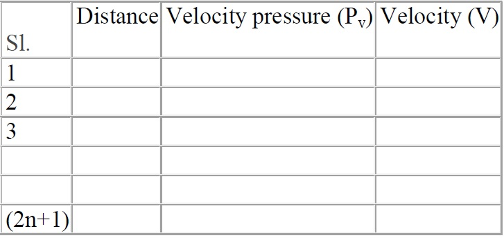
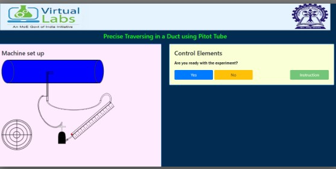
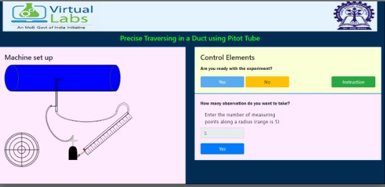
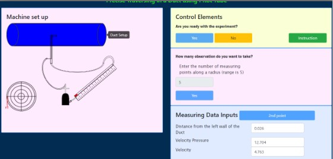
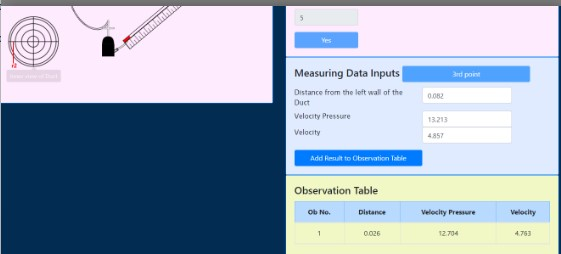
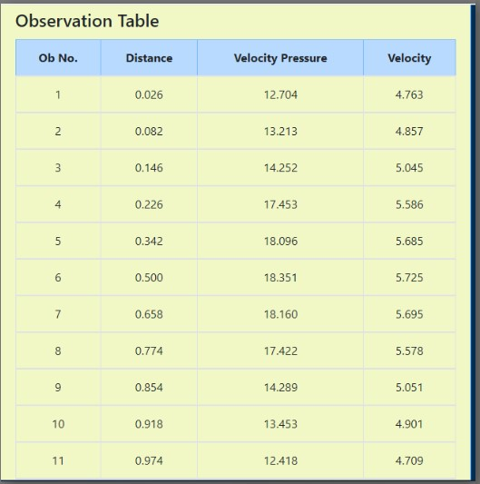
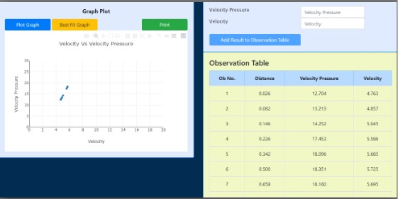
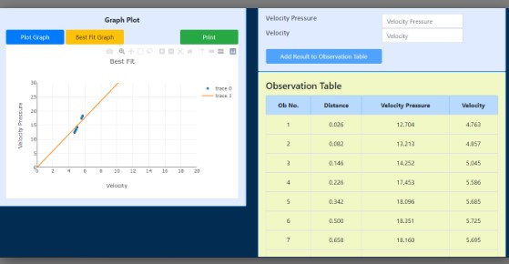

## Procedure

Detail procedure for conducting this experiment is given below.

1. Diameter of the duct is measured by measuring tape or scale.
2. The measuring distance from the walls for the respective measuring points are marked on the Pitot static tube.
3. Pitot tube is placed at respective location.
4. Two ends of DPCal are attached to the static pressure and total pressure end of the Pitot tube.
5. Velocity pressure is noted at the particular location.
6. The process is repeated to measure the velocity for all the measuring points.
7. Average velocity is calculated and the velocity profile is drawn using these data.

The experimental might be tabulated as the given table1 below.

## Simulator Procedure 

The following procedure is to be followed by the user in order to Precise traversing in a duct using Pitot tube:

Click "Yes" button to start the experiment.

Enter the number of measuring points for the traversing.Then press the yes button to start the traversing using Pitot tube.

After that press the button "1st Point" to measure the first point traversing.

After that add this result to the observation table by clicking the button add result to the observation table.

After that measure the 2nd point, 3rd point, 4th point till the 11th point doing the same process and add result to the observation table.

After all the points are measured plot the graph by clicking the button "Plot Graph".

Click "best fit" to add best fit line and then print it by clicking the button "Print".

