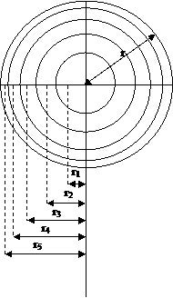

## Theory

The velocity of air flow varies from point to point over the cross-section of a duct airway and the variation is irregular in nature, particularly if the duct airway has rough sides and is not straight. The velocity profile of airway can change depending upon the Reynolds number of the flow, surface roughness, and the nature of the flow e.g. whether the flow is under developed or fully developed. The typical velocity profile of a circular duct for a fully developed flow is in parabolic shape for laminar flow and D-shaped for a turbulent flow. The nature of the velocity profile has been discussed in number text books (Misra, 1988; Harman and Mutmansky, 1997; McPherson, 1993). The nature of the velocity profile can be observed through a laboratory experiment. Besides the study of velocity profile, the average velocity can also be estimated by measuring the air velocity at the different points of the cross-section. In general, average air velocity can be measured by two methods: (i) continuous traversing, and (ii) precise traversing. The continuous traversing, although simple and rapid; it is not highly accurate (accuracy is almost 5%). Precise traversing is time consuming but very accurate. An accuracy of 2% can be achieved by this method. In order to conduct the precise traversing, the whole cross-section is divided into certain number of equal areas. The number of division depends upon the number of measuring points. The instrument measures the velocity at the midpoint of these equal areas. For a typical circular duct, these equal areas essentially become concentric circles of different radius. The locations of the measuring points can be derived using the following formula and shown in Figure1.

$$ r_i = r \sqrt \frac{2i-1}{2n}  ----------(1) $$

Where,  
ri is the ith radius of the concentric circles from the center of the circular duct.  
r is the radius of the circular duct.  
n is the number of measuring points along a radius.  

For example, if number of the observations is taken as five along a radius, the total number of measuring points will be 10 along the two radii, and an additional measurement at the centre. By solving the equation1, r1 = 0.316 r from the center of the duct. This distance will be 0.684r from the left wall of the duct. In the similar fashion location of the measuring points can be found out using above formula. For five point's measurement along a radius, the locations of measuring points are from the left wall 0.026D, 0.082D, 0.146D, 0.226D, 0.342D, 0.774D, 0.854D, 0.919D and 0.975D. Here, D is the diameter of the cross-section of the duct.

Figure1: Location of velocity measuring points in a circular duct to measure the air velocity at different measuring point at a duct cross-section, a Pitot static tube might be used to measure velocity pressures (Pv) at the measuring points from where air velocity can be calculated using the following equation.

$$ P_v =\frac{1}{2} \rho V_2 $$

$$ V = \sqrt \frac{2P_v}{\rho}  ----------(2) $$

Where,  
Pv = velocity pressure in Pa,  
ρ = air density in kg/m3 and  
V = air velocity in m/s  

The average velocity of the air will then be the simple arithmetic average of the measured point velocities. Using the velocity values the velocity profile can also be drawn.

## Apparatus used:
The required instruments in this experiment are given below

- Pitot tube
- DPCal
- Measuring tape or scale

## Demo

<!-- blank line -->
<figure class="video_container">
  <iframe src="https://www.youtube.com/embed/YOjP8_TBGlQ" frameborder="0" allowfullscreen="true"> </iframe>
</figure>
<!-- blank line --> 

<!-- blank line -->
<figure class="video_container">
  <iframe src="https://www.youtube.com/embed/QQke2hGguLc" frameborder="0" allowfullscreen="true"> </iframe>
</figure>
<!-- blank line --> 

